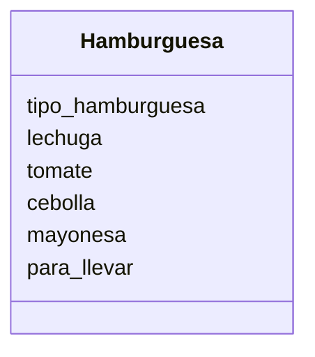

# Restaurante

Un restaurante quiere ofrecer hamburguesas
Los clientes pueden elegir entre hamburguesa de: res, pollo o vegetariana.
Los clientes pueden agregar extras como: lechuga, tomate, cebolla y mayonesa
Ademas los clientes pueden decidir comer en el restaurante o llevar su pedido

## Análisis

Requisitos:

- Ofrece hamburguesas de res, pollo o vegetariana
- Agregar lechuga
- Agregar tomate
- Agregar cebolla
- Agregar mayonesa
- Los clientes deciden comer en el restaurante o ordenar para llevar

Objetos:

- Hamburguesa

Caracteristicas:

- Hamburguesa
  - tipo_hamburguesa
  - lechuga
  - tomate
  - cebolla
  - mayonesa
  - para_llevar

Acciones:

- (No hay acciones)

## Diseño

Clases:

- Hamburguesa
  - nombre: Hamburguesa
  - atributos:
    - tipo_hamburguesa
    - lechuga
    - tomate
    - cebolla
    - mayonesa
    - para_llevar
  - metodos:
    - (no hay métodos)

