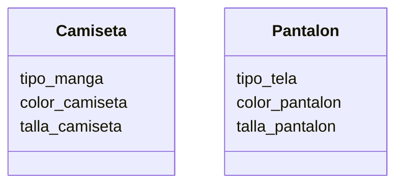

# Tienda de Ropa

Una tienda de ropa quiere ofrecer camisetas y pantalones
Los clientes pueden elegir entre: camiseta de manga corta o larga y pantalón de mezclilla o tela
Las camisetas pueden ser de color rojo, azul o verde y los pantalones de color negro, gris o blanco
Las camisetas tienen las tallas: S, M, L, XL
Los pantalones tienen las tallas desde la 32 hasta la 44

## Análisis

Requisitos:

- La simulación debe modelar camisetas y pantalones.
- La camiseta debe registrar el tipo de manga (corta o larga)
- El pantalón debe registrar su tipo de material (mezclilla o tela)
- La camiseta debe registrar su color (rojo, azul o verde)
- El pantalón debe registrar su color (negro, gris o blanco)
- La camiseta debe registrar su talla (S, M, L, XL)
- El pantalón debe registrar su talla (desde 32 hasta 44)

Objetos:

- Camiseta
- Pantalon

Caracteristicas:

- Camiseta
  - tipo_manga
  - color_camiseta
  - talla_camiseta

- Pantalon
  - tipo_tela
  - color_pantalon
  - talla_pantalon

Acciones:

- (no hay acciones)

## Diseño

Clases:

- Camiseta
  - Nombre: Camiseta
  - Atributos:
    - tipo_manga
    - color_camiseta
    - talla_camiseta
  - Metodos:
    - (No hay metodos)

- Pantalon
  - Nombre: Pantalon
  - Atributos:
    - tipo_tela
    - color_pantalon
    - talla_pantalon
  - Metodos:
    - (No hay metodos)

