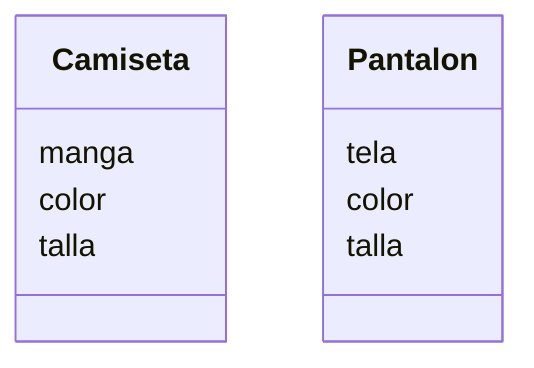

# Tienda de Ropa

Una tienda de ropa quiere ofrecer camisetas y pantalones
Los clientes pueden elegir entre: camiseta de manga corta o larga y pantalón de mezclilla o tela
Las camisetas pueden ser de color rojo, azul o verde y los pantalones de color negro, gris o blanco
Las camisetas tienen las tallas: S, M, L, XL
Los pantalones tienen las tallas desde la 32 hasta la 44

## Análisis

Requisitos:

- Ofrece camisetas y pantalones
- Elegir camiseta de manga corta o larga
- Elegir pantalón de mezclilla o tela
- Color camiseta: rojo, azul o verde
- Color pantalon: negro, gris o blanco
- Talla camiseta: S, M, L, XL
- Talla pantalon: desde la 32 hasta la 44

Objetos:

- Camiseta
- Pantalon

Caracteristicas:

- Camiseta
  - manga
  - Color
  - Talla

- Pantalon
  - Tela
  - Color
  - Talla

Acciones:

- (No hay acciones)

## Diseño

Clases:

- Camiseta
  - Nombre: Camiseta
  - Atributos:
    - manga
    - color
    - talla
  - Métodos:
    - (No hay métodos)

- Pantalon
  - Nombre: Pantalon
  - Atributos:
    - tela
    - color
    - talla
  - Métodos:
    - (No hay métodos)

