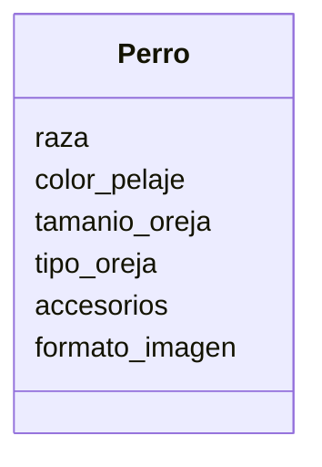

# App para dibujar perros

Estas diseñando una app para dibujar de perros con IA los usuarios pueden seleccionar características como la raza (por ejemplo, labrador o pastor alemán), el color del pelaje, el tamaño y el tipo de orejas.
Además, pueden agregar hasta dos accesorios, como sombreros o gafas.
El dibujo final puede descargarse en formato PNG o JPG.

## Análisis

Requisitos:

- Seleccionar raza: labrador o pastor alemán
- Seleccionar color del pelaje
- Selecionar tamaño de la oreja
- Selecionar tipo de la oreja
- Agregar sombrero
- Agregar gafas
- Formato de dibujo: PNG o JPG

Objetos:

- Perro

Caracteristicas:

- Perro
  - raza
  - color_pelaje
  - tamanio_oreja
  - tipo_oreja
  - accesorio
  - formato_imagen

Acciones:

- (no hay acciones)

## Diseño

Clases:

- Perro
  - nombre: Perro
  - atributos:
    - raza
    - color_pelaje
    - tamanio_oreja
    - tipo_oreja
    - accesorios
    - formato_imagen
  - metodos:
    - (no hay métodos)

