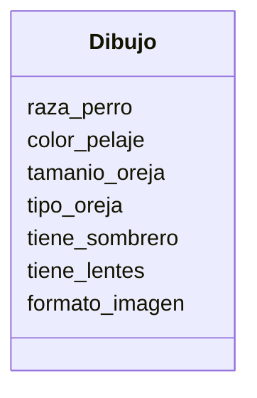

# App para dibujar perros

Estas diseñando una app para dibujar de perros con IA los usuarios pueden seleccionar características como la raza (por ejemplo, labrador o pastor alemán), el color del pelaje, el tamaño y el tipo de orejas.
Además, pueden agregar hasta dos accesorios, como sombreros o gafas.
El dibujo final puede descargarse en formato PNG o JPG.

## Análisis

Requisitos:

- La aplicación debe modelar un dibujo de perro
- El Dibujo debe registrar la raza
- El Dibujo debe registrar el color del pelaje
- El Dibujo debe registrar el tamaño de la oreja
- El Dibujo debe registrar el tipo de oreja
- El Dibujo debe registrar hasta dos accesorios
- El Dibujo debe registrar si lleva o no un sombrero
- El Dibujo debe registrar si lleva o no lentes
- El Dibujo debe permitir descargar la imagen en formato PNG o JPG

Objetos:

- Dibujo

Caracteristicas:

- Dibujo
  - raza_perro
  - color_pelaje
  - tamanio_oreja
  - tipo_oreja
  - tiene_sombrero
  - tiene_lentes
  - formato_imagen

Acciones:

- Dibujo
  - (No hay acciones)

## Diseño

Clases:

- Dibujo
  - Nombre: Dibujo
  - Atributos:
    - raza_perro
    - color_pelaje
    - tamanio_oreja
    - tipo_oreja
    - tiene_sombrero
    - tiene_lentes
    - formato_imagen
  - Metodos:
    - (No hay metodos)

