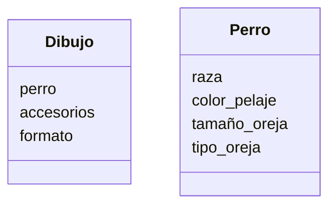

# App para dibujar perros

Estas diseñando una app para dibujar de perros con IA los usuarios pueden seleccionar características como la raza (por ejemplo, labrador o pastor alemán), el color del pelaje, el tamaño y el tipo de orejas.
Además, pueden agregar hasta dos accesorios, como sombreros o gafas.
El dibujo final puede descargarse en formato PNG o JPG.

## Análisis

Requisitos:

- Seleccionar raza: labrador o pastor alemán
- Seleccionar color del pelaje
- Selecionar tamaño de la oreja
- Selecionar tipo de la oreja
- Agregar sombrero
- Agregar gafas
- Formato de dibujo: PNG o JPG

Objetos:

- Dibujo
- Perro

Caracteristicas:

- Dibujo
  - Perro
  - Accesorio
  - Formato

- Perro
  - Raza
  - Color_pelaje
  - Tamaño_oreja
  - Tipo_oreja

Acciones:

- (No hay acciones)

## Diseño

Clases:

- Dibujo
  - Nombre: Dibujo
  - Atributos:
    - perro
    - accesorios
    - formato
  - Métodos:
    - (No hay métodos)

- Perro
  - Nombre: Perro
  - Atributos:
    - raza
    - color_pelaje
    - tamaño_oreja
    - tipo_oreja
  - Métodos:
    - (No hay métodos)

