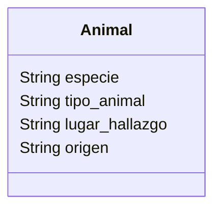

# Zoologico

Un zoológico quiere llevar un registro de los animales que llegan a sus instalaciones.
Necesitan registrar su especie, tipo y lugar donde los encontraron.
Los animales del zoológico pueden ser mamíferos, reptiles o aves.
El origen de todos los animales es "feral".
Este zoológico cuenta con 2 mamíferos, 1 reptil y 1 ave

## Analisis

Requisitos:

- La simulación debe modelar un Animal de zoologico
- El Animal debe registrar su especie.
- El Animal debe registrar su clasificación (mamífero, reptil o ave)
- El Animal debe registrar el lugar donde fue encontrado
- Todos los Animal deben registrar su origen como feral

Objetos:

- Animal

Características:

- Animal
  - especie: String
  - tipo_animal: String
  - lugar_hallazgo: String
  - origen: String

Acciones:

- (No hay acciones)

## Diseño

Clases:

- Animal
  - Nombre: Animal
  - Atributos:
    - especie: String
    - tipo_animal: String
    - lugar_hallazgo: String
    - origen: String
  - Metodos:
    - (No hay metodos)

