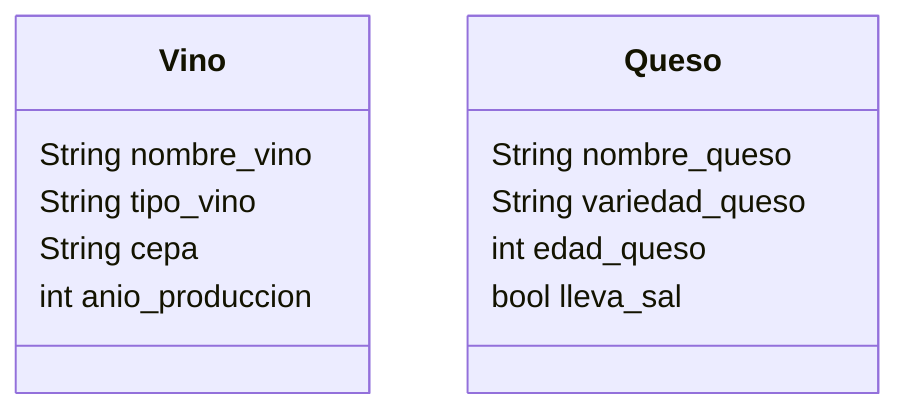

# Vinoteca

Una vinoteca quiere registrar los vinos y quesos que ofrecen.
De cada vino se necesita registrar su nombre, tipo, cepa y año de producción.
De cada queso se necesita registrar su nombre, variedad, edad y si lleva sal.
La vinoteca tiene en su inventario 4 vinos y 3 quesos

## Analisis

Requisitos:

- La vinoteca debe modelar las entidades vino y queso
- El vino debe registrar el nombre del vino
- El vino debe registrar el tipo de vino
- El vino debe registrar la cepa a la que pertenece el vino
- El vino debe registrar el año de produccion del vino
- El Queso debe registrar su nombre
- El Queso debe registrar la variedad a la que pertenece
- El Queso debe registrar la edad que tiene
- El Queso debe registrar si lleva o no sal

Objetos:

- Vino
- Queso

Características:

- Vino
  - nombre_vino: String
  - tipo_vino: String
  - cepa: String
  - anio_produccion: int
- Queso
  - nombre_queso: String
  - variedad_queso: String
  - edad_queso: int
  - lleva_sal: bool

Acciones:

- (No hay acciones)

## Diseño

Clases:

- Vino
  - Nombre: Vino
  - Atributos:
    - nombre_vino: String
    - tipo_vino: String
    - cepa: String: int
    - anio_produccion
  - Metodos:
    - (No hay metodos)
- Queso
  - Nombre: Queso
  - Atributos:
    - nombre_queso: String
    - variedad_queso: String
    - edad_queso: int
    - lleva_sal: bool
  - Metodos:
    - (No hay metodos)

