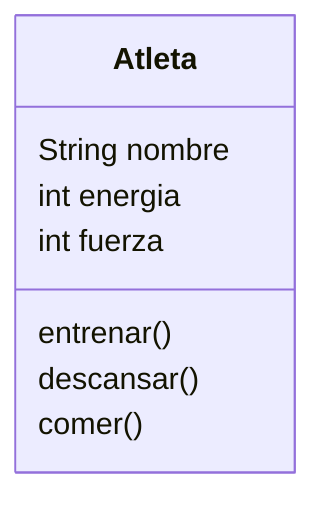

# Juego de ROL

Imagina un juego de rol en el que el personaje principal es un atleta.
Este personaje tiene tres atributos principales:
`nombre`: identifica al atleta
`energía`: representa su nivel de energía actual.
`fuerza`: indica su capacidad física.

Cada atleta puede realizar las siguientes acciones:
`Entrenar`: aumenta su fuerza, pero consume energía.
`Descansar`: recupera energía.
`Comer`: solo puede consumir hamburguesas, lo que también le ayuda a recuperar energía.

## Analisis

Requisitos:

- El atleta debe registrar su nombre
- El atleta debe registrar su nivel de energia
- El atleta debe registrar su cantidad fuerza
- El atleta puede realizar acciones para aumentar o reducir sus valores
de energia o fuerza
- El atleta puede entrenar para aumenta la fuerza y disminuir la energia
- El atlera puede descansar para recuperar energia
- El atleta solo puede comer hamburguesa para recuperar energia

Objetos:

- Atleta

Caracteristicas:

- Atleta:
  - nombre: String
  - energia: int
  - fuerza: int
  
Acciones:

- Atleta:
  - entrenar()
  - descansar()
  - comer()

## Diseño

Clases:

- Atleta
  - Nombre: Atleta
  - Atributos:
    - nombre: String
    - energia: int
    - fuerza: int
  - Metodos:
    - entrenar()
    - descansar()
    - comer()

