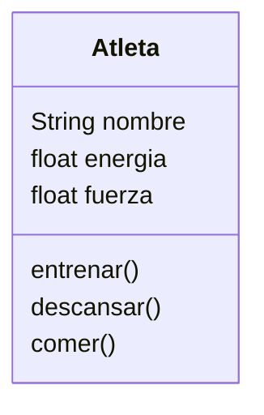

# Juego de ROL

Imagina un juego de rol en el que el personaje principal es un atleta.
Este personaje tiene tres atributos principales:
`nombre`: identifica al atleta
`energía`: representa su nivel de energía actual.
`fuerza`: indica su capacidad física.

Cada atleta puede realizar las siguientes acciones:
`Entrenar`: aumenta su fuerza, pero consume energía.
`Descansar`: recupera energía.
`Comer`: solo puede consumir hamburguesas, lo que también le ayuda a recuperar energía.

## Analisis

Requisitos:

- Crear un atleta
- El atleta tiene tres atributos: nombre, energia, fuerza
- El atleta puede entrenar, descansar y comer
- Entrenar aumenta la fuerza pero disminuye la energia
- Descansar aumenta la energia
- Comer hamburguesas aumenta la energia

Objetos:

- Atleta

Características:

- Atleta: `nombre`, `energía`, `fuerza`
  
Acciones:

- Atleta: `Entrenar`, `Descansar`, `Comer`

## Diseño

