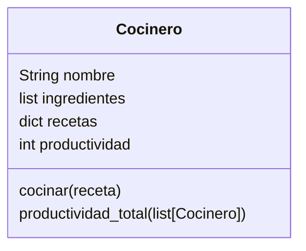

# Cocina Profecional

Imagina un sistema que modela el trabajo de cocineros en una cocina profesional.
Cada cocinero tiene tres elementos clave:
Una lista de `ingredientes` disponibles.
Un conjunto de `recetas` definidas que puede preparar
Un contador de `productividad`, que aumenta cada vez que prepara una receta con éxito. Si hay más de un cocinero, sus puntos individuales pueden sumarse para obtener una métrica agregada de productividad.
Las únicas recetas permitidas en el sistema son:
Receta -> Ingredientes Requeridos
`pan` -> harina, agua
`pizza` -> harina, agua, sal, tomate, queso
`galleta` -> harina, agua, sal, chocolate

## Analisis

Requisitos:

- El cocinero debe registrar su inventario de ingredientes disponibles
- El cocinero debe registrar las recetas que puede preparar
- El cocinero debe registrar su nivel de productividad
- El cocinero debe incrementar su productividad al preparar una receta con exito
- Se puede calcular la produtividad del equipo si hay mas de un cocinero
- Solo existen las recetas: pan, pizza y galleta

Objetos:

- Cocinero

Características:

- Cocinero:
  - nombre: Strin
  - ingredientes: List[String]
  - recetas: dict
  - productividad: int
  
Acciones:

- Cocinero:
  - cocinar
  - productividad_total

## Diseño

Clases:

- Cocinero
  - Nombre: Cocinero
  - Atributos:
    - nombre: String
    - ingredientes: List[String]
    - recetas: dict
    - productividad: int
  - Metodos:
    - cocinar()
    - productividad_total()

