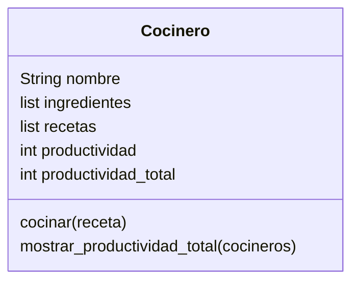

# Cocina Profecional

Imagina un sistema que modela el trabajo de cocineros en una cocina profesional.
Cada cocinero tiene tres elementos clave:
Una lista de `ingredientes` disponibles.
Un conjunto de `recetas` definidas que puede preparar
Un contador de `productividad`, que aumenta cada vez que prepara una receta con éxito. Si hay más de un cocinero, sus puntos individuales pueden sumarse para obtener una métrica agregada de productividad.
Las únicas recetas permitidas en el sistema son:
Receta -> Ingredientes Requeridos
`pan` -> harina, agua
`pizza` -> harina, agua, sal, tomate, queso
`galleta` -> harina, agua, sal, chocolate

## Analisis

Requisitos:

- Crear un cocinero
- Cada cocinero tiene una lista de ingredientes disponibles
- Los cocineros pueden preparar recetas si tienen todos los ingredientes requeridos
- Cada vez que cocina con éxito, aumenta su productividad
- Se puede calcular la productividad total de todos los cocineros

Objetos:

- Cocinero

Características:

- Cocinero: `nombre`, `ingredientes`, `recetas`, `productividad`, `productividad_total`
  
Acciones:

- Cocinero: `cocinar`, `mostrar_productividad_total`

## Diseño

