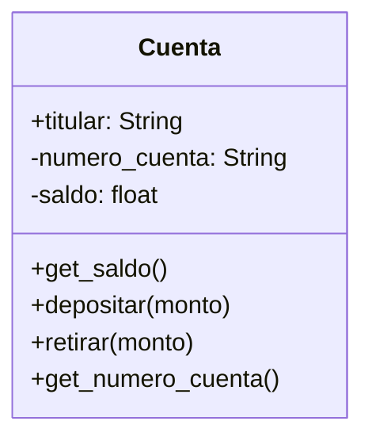

# Entidad Bancaria

Un banco necesita desarrollar un módulo para gestionar cuentas bancarias. Cada
cuenta tiene las siguientes caracteristicas:

- `saldo`: Es un dato privado. Solo puede consultar. Se puede modificar
únicamente a través de deposito y retiro
- `deposito`: Permite ingresar dinero, incrementando el saldo.
- `retiro`: Permite retirar dinero, siempre y cuando el saldo disponible sea
suficiente.
- `número` de cuenta: Es privado. Puede consultarse, pero no puede modificarse
una vez asignado.
- `nombre del titular`: Es público. Puede consultarse y modificarse libremente.

## Analisis

Requisitos:

- Un banco necesita un modulo para gestionar cuentas
- Las cuentas tienen un saldo que es privado
- El saldo solo se modifica al depositar o retirar
- Depositar incrementa el saldo
- Retirar reduce el saldo y solo si el saldo es suficiente
- Las cuentas tienen un Numero de cuenta que es privado
- EL numero de cuenta no puede modificarse
- El nombre del titular es publico
- El nombre del titular puede modificarse

Objetos:

- Cuenta

Características:

- Cuenta:
  - titular: String
  - numero_cuenta: String
  - saldo: float

Acciones:

- Cuenta:
  - get_saldo()
  - depositar(monto)
  - retirar(monto)
  - get_numero_cuenta()

## Diseño

