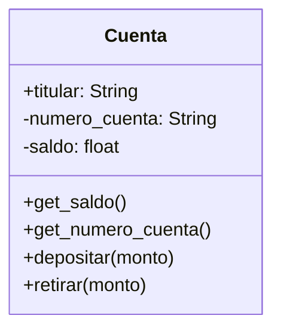

# Entidad Bancaria

Un banco necesita desarrollar un módulo para gestionar cuentas bancarias. Cada
cuenta tiene las siguientes caracteristicas:

- `saldo`: Es un dato privado. Solo puede consultar. Se puede modificar
únicamente a través de deposito y retiro
- `deposito`: Permite ingresar dinero, incrementando el saldo.
- `retiro`: Permite retirar dinero, siempre y cuando el saldo disponible sea
suficiente.
- `número` de cuenta: Es privado. Puede consultarse, pero no puede modificarse
una vez asignado.
- `nombre del titular`: Es público. Puede consultarse y modificarse libremente.

## Analisis

Requisitos:

- Un banco debe modelar cuentas bancarias
- La cuenta debe registrar su número de identificación
- EL numero de cuenta puede consultarse, pero no modificarse
- La cuenta debe registrar el nombre del titular
- El nombre del titular puede consultarse y modificarse
- La cuenta debe registrar su saldo
- El saldo puede consultarse, pero no modificarse
- El saldo se puede modificar al depositar o retirar
- La cuenta debe incrementar su saldo al depositar dinero
- La cuenta debe reducir su saldo al retirar dinero, siempre que los fondos
sean suficientes

Objetos:

- Cuenta

Características:

- Cuenta:
  - titular: String
  - numero_cuenta: String
  - saldo: float

Acciones:

- Cuenta:
  - get_saldo()
  - get_numero_cuenta()
  - depositar(monto)
  - retirar(monto)

## Diseño

Clases:

- Cuenta
  - Nombre: Cuenta
  - Atributos:
    - titular: String
    - numero_cuenta: String
    - saldo: float
  - Metodos:
    - get_saldo()
    - get_numero_cuenta()
    - depositar()
    - retirar()

