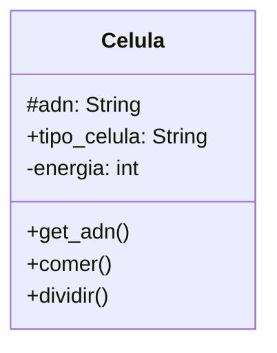

# Comportamiento celular

Un médico necesita simular el comportamiento de una célula. Cada célula
debe cumplir con las siguientes características:

- `ADN`: Se puede consultar pero no puede cambiar.
- `tipo de célula`: Puede consultarse y modificarse libremente.
- `energía`: Es un dato privado. Puede aumentar o disminuir, únicamente
mediante las acciones de comer o dividirse.

## Analisis

Requisitos:

- Cada celula tiene las estos atributos: ADN, tipo de celula y energia
- El ADN puede consultarse pero no modificarse
- el tipo de celula puede consultarse y modificarse
- la energia es un dato privado
- la energia puede aumentar al comer
- la energia puede disminuir al dividirse

Objetos:

- Celula

Características:

- Celula:
  - ADN: String
  - tipo_celula: String
  - energia: int

Acciones:

- Celula:
  - get_ADN()
  - comer()
  - dividir()

## Diseño

