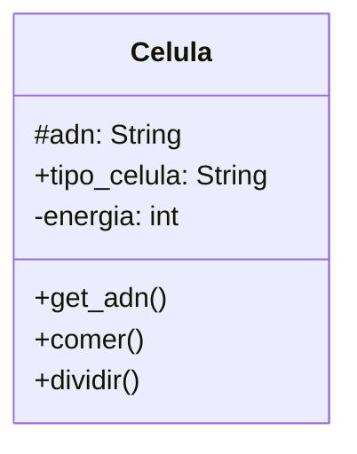

# Comportamiento celular

Un médico necesita simular el comportamiento de una célula. Cada célula
debe cumplir con las siguientes características:

- `ADN`: Se puede consultar pero no puede cambiar.
- `tipo de célula`: Puede consultarse y modificarse libremente.
- `energía`: Es un dato privado. Puede aumentar o disminuir, únicamente
mediante las acciones de comer o dividirse.

## Analisis

Requisitos:

- La celula debe registrar su tipo de ADN
- El tipo de ADN se puede consultar pero no modificar
- La celula debe registrar su tipo de celula al que pertenece
- El tipo de celula se puede consultar y modificar
- La celula debe registrar su nivel de energia
- La celula solo puede modificar su energía a través de las acciones de comer o dividirse
- La celula debe incrementar su energía al comer
- La celula debe disminuir su energía al dividirse

Objetos:

- Celula

Características:

- Celula:
  - adn: String
  - tipo_celula: String
  - nivel_energia: int

Acciones:

- Celula:
  - get_adn()
  - comer()
  - dividir()

## Diseño

Clases:

- Celula
  - Nombre: Celula
  - Atributos:
    - adn: String
    - tipo_celula: String
    - nivel_energia: int
  - Metodos:
    - get_adn()
    - comer()
    - dividir()

