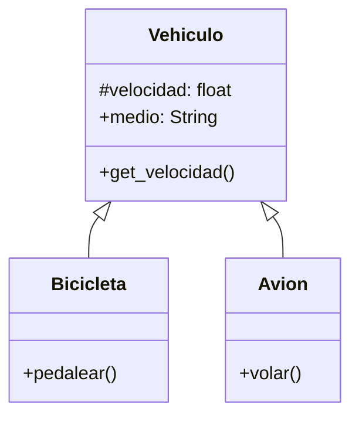

# Empresa de Transporte

Una empresa de transporte desea desarrollar una simulación que represente el comportamiento de sus distintos vehículos.
Todo vehículo posee las siguientes características:

- `velocidad`: Es un dato protegido. Puede consultarse, pero solo modificarse mediante acciones específicas.
- `medio`: Representa el entorno en el que se desplaza el vehículo (por ejemplo, terrestre, acuático, aéreo). Puede consultarse y modificarse libremente.

Existen dos tipos de vehículos con características específicas:

- `Bicicleta`: Incrementar su velocidad mediante la acción de `pedalear`.
- `Avión`: Incrementar su velocidad mediante la acción de `volar`.

## Análisis

Requisitos:

- El vehiculo debe registrar su velocidad
- La velocidad puede consultarse pero no modificarse
- El vehículo debe registrar el medio por el que se desplaza.
- El medio puede consultarse y modificarse
- Existen dos tipos de vehiculos (bicicleta, avión)
- La bicicleta puede incrementar su velocidad al pedalear.
- El avión puede incrementar su velocidad al volar.

Objetos:

- Vehiculo (clase padre)
- Bicicleta (clase hija)
- Avion (clase hija)

Características:

- Vehiculo:
  - velocidad: float
  - medio: String
- Bicicleta:
  - (Sin características)
- Avion:
  - (Sin características)

Acciones:

- Vehiculo:
  - get_velocidad()
- Bicicleta:
  - pedalear()
- Avion:
  - volar()

## Diseño

Clases:

- Vehiculo
  - Nombre: Vehiculo
  - Atributos:
    - velocidad: float
    - medio: String
  - Metodos:
    - get_velocidad()

- Bicicleta
  - Nombre: Bicicleta
  - Atributos:
    - (no hay atributos)
  - Metodos:
    - pedalear()

- Avion
  - Nombre: Avion
  - Atributos:
    - (no hay atributos)
  - Metodos:
    - volar()

