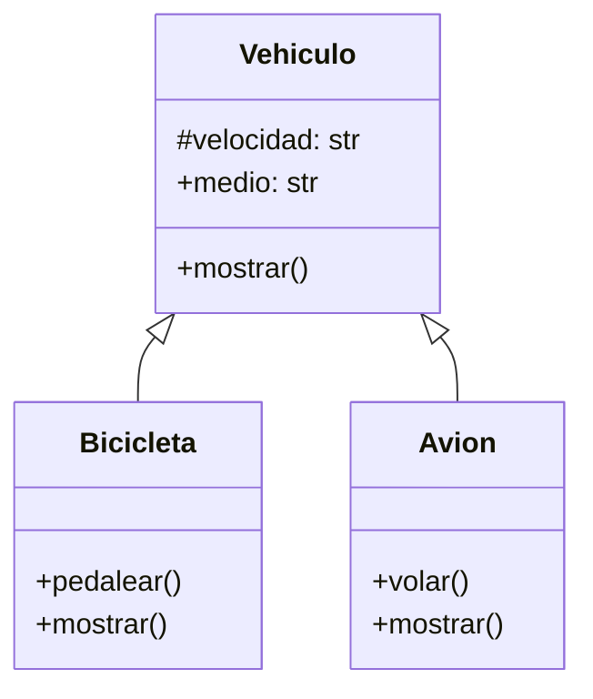

# Empresa de Transporte

Una empresa de transporte desea desarrollar una simulación que represente el comportamiento de sus distintos vehículos.
Todo vehículo posee las siguientes características:

- `velocidad`: Es un dato protegido. Puede consultarse, pero solo modificarse mediante acciones específicas.
- `medio`: Representa el entorno en el que se desplaza el vehículo (por ejemplo, terrestre, acuático, aéreo). Puede consultarse y modificarse libremente.

Existen dos tipos de vehículos con características específicas:

- `Bicicleta`: Incrementar su velocidad mediante la acción de `pedalear`.
- `Avión`: Incrementar su velocidad mediante la acción de `volar`.

## Análisis

Requisitos:

- Los vehiculos tienen las siguientes caracteristicas: velocidad y medio
- La velocidad es un dato protegido
- La velocidad puede consultarse
- La velocidad solo puede modificarse mediante acciones especificas
- El medio medio representa el entorno en el que se desplaza el vehiculo
- Existen dos tipos de vehiculos: Bicicleta y Avion
- La bicicleta incremeta su velocidad con la accion pedalear
- El avion incrementa su velocidad con la accion volar

Objetos:

- Vehiculo (Clase Padre)
- Bicicleta (hereda de Vehiculo)
- Avion (hereda de Vehiculo)

Características:

- Vehiculo:
  - velocidad: float
  - medio: String
- Bicicleta:
  - (sin características)
- Avion:
  - (sin características)

Acciones:

- Vehiculo:
  - mostrar
- Bicicleta:
  - pedalear
  - mostrar
- Avion:
  - volar
  - mostrar

## Diseño

