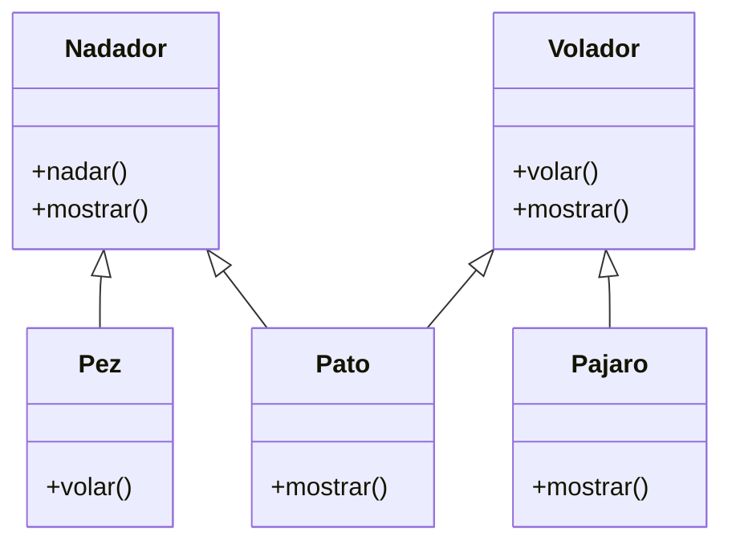

# Videojuego

Debes desarrollar un videojuego tipo aventura, donde los personajes tiene
distintas habilidades
Cada personaje pertenece a uno o más tipos que definen sus comportamientos:

- `Nadador`: Puede ejecutar la acción `nadar()`, que representa la acción de
desplazarse en el agua.
- `Volador`: Puede ejecutar la acción `volar()`, que representa la acción de
desplazarse por el aire.

En el juego existen tres personajes principales, cada uno con habilidades específicas:

- `Pez`: tiene la habilidad de nadar.
- `Pájaro`: tiene la habilidad de volar.
- `Pato`: tiene ambas habilidades, puede nadar y volar.
Cada personaje debe contar con un método `mostrar()` que indique el tipo de
personaje y su habilidad principal o combinada.

## Análisis

Requisitos:

- Un personaje pertenece a uno o mas tipos: nadador, volador
- EL nadador puede ejecutar la accion nadar, se desplaza por agua
- El volador puede ejecutar la accion volar, se desplaza por aire
- Existen tres personajes: Pez, Pajaro y Pato
- Pez tiene la habilidad de nadar
- Pajaro tiene la avilidad de volar
- Pato tiene las habilidades de nadar y volar
- Cada personaje tiene el metodo mostrar
- Mostrar indica el tipo de personaje y su habilidad

Objetos:

- Nadador (Clase Padre)
- Volador (Clase Padre)
- Pez (hereda de Nadador)
- Pájaro (hereda de Volador)
- Pato (hereda de Nadador y Volador)

Características:

- Nadador:
  - (sin características)
- Volador:
  - (sin características)
- Pez:
  - (sin características)
- Pájaro
  - (sin características)
- Pato
  - (sin características)

Acciones:

- Nadador:
  - nadar
  - mostrar
- Volador:
  - volar
  - mostrar
- Pez:
  - mostrar
- Pájaro
  - mostrar
- Pato
  - mostrar

## Diseño

