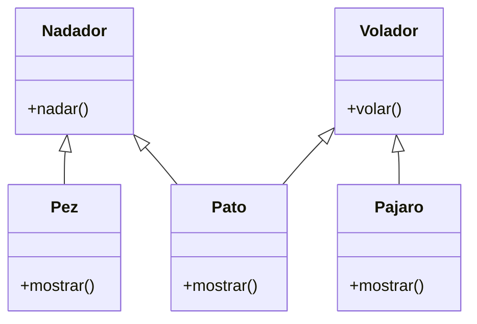

# Videojuego

Debes desarrollar un videojuego tipo aventura, donde los personajes tiene
distintas habilidades
Cada personaje pertenece a uno o más tipos que definen sus comportamientos:

- `Nadador`: Puede ejecutar la acción `nadar()`, que representa la acción de
desplazarse en el agua.
- `Volador`: Puede ejecutar la acción `volar()`, que representa la acción de
desplazarse por el aire.

En el juego existen tres personajes principales, cada uno con habilidades específicas:

- `Pez`: tiene la habilidad de nadar.
- `Pájaro`: tiene la habilidad de volar.
- `Pato`: tiene ambas habilidades, puede nadar y volar.
Cada personaje debe contar con un método `mostrar()` que indique el tipo de
personaje y su habilidad principal o combinada.

## Análisis

Requisitos:

- El videojuego debe modelar los tipos de personaje Nadador, Volador,
o la combinación de ambos
- El personaje tipo Nadador debe ejecutar la habilidad nadar
- El personaje tipo Volador debe ejecutar la habilidad volar
- En el juego existen tres personajes principales: Pez, Pajaro y Pato
- El Pez debe tener la habilidad de nadar
- El Pajaro debe tener la habilidad de volar
- El Pato debe tener las habilidades de nadar y volar
- Cada personaje debe mostrar su tipo y su habilidad

Objetos:

- Nadador (Clase Padre)
- Volador (Clase Padre)
- Pez (hereda de Nadador)
- Pajaro (hereda de Volador)
- Pato (hereda de Nadador y Volador)

Características:

- Nadador:
  - (sin características)
- Volador:
  - (sin características)
- Pez:
  - (sin características)
- Pajaro
  - (sin características)
- Pato
  - (sin características)

Acciones:

- Nadador:
  - nadar()
- Volador:
  - volar()
- Pez:
  - mostrar()
- Pajaro
  - mostrar()
- Pato
  - mostrar()

## Diseño

Clases:

- Nadador
  - Nombre: Nadador
  - Atributos:
    - (no hay atributos)
  - Metodos:
    - nadar()

- Volador
  - Nombre: Volador
  - Atributos:
    - (no hay atributos)
  - Metodos:
    - volar()

- Pez
  - Nombre: Pez
  - Atributos:
    - (no hay atributos)
  - Metodos:
    - mostrar()

- Pajaro
  - Nombre: Pajaro
  - Atributos:
    - (no hay atributos)
  - Metodos:
    - mostrar()

- Pato
  - Nombre: Pato
  - Atributos:
    - (no hay atributos)
  - Metodos:
    - mostrar()

