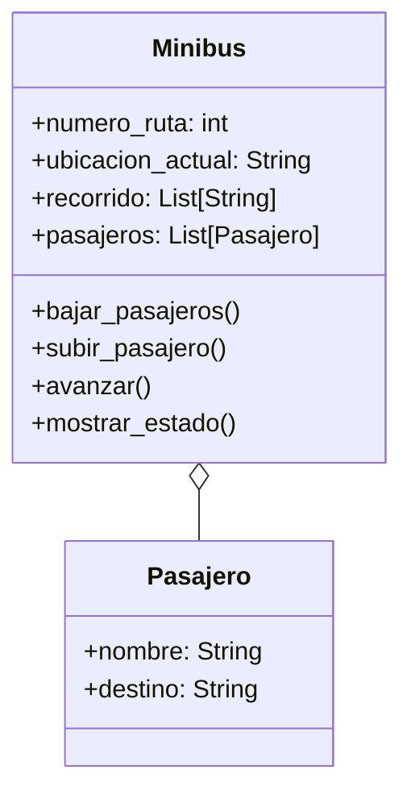

# Transporte

En su trayecto diario al trabajo, las personas pueden abordar distintos minibuses. Cada minibus está identificado por un número de ruta y sigue un recorrido compuesto por varias paradas (ubicaciones). Por otro lado, cada pasajero tiene un nombre y una ubicación de destino a la que desea llegar.
Los pasajeros pueden subir o bajar del minibus en cualquier parada, pero bajo las siguientes condiciones:

- Un pasajero solo puede subir si el recorrido del minibus incluye su destino entre las paradas programadas.
- Un pasajero solo puede bajar si la parada actual del minibus coincide con su destino.
- Las paradas son circulares: al llegar al final del recorrido, el minibus invierte su lista de paradas y regresa en sentido contrario.

Diseñar las clases necesarias para representar Minibus y Pasajero.
Toma en cuenta las siguientes características:

- Un minibus tiene una lista de paradas programadas (ejemplo: ["Arce", "Prado", "Perez"]).
- Un minibus puede transportar múltiples pasajeros.
- Simular el movimiento del minibus entre paradas y las acciones de subida y bajada de pasajeros.

## Análisis

Requisitos:

- El minibus debe registrar su número de ruta y el recorrido
- El recorrido de estar conformado por varias paradas (ubicaciones)
- El minibus debe registrar la lista de pasajeros que transporta
- El pasajero debe registrar su nombre y ubicación de destino
- El minibus debe permitir subir a un pasajero solo si el recorrido incluye el destino del pasajero
- El minibus debe permitir bajar a un pasajero solo si la parada actual coincide con su destino
- El minibus debe invertir el orden del recorrido al alcanzar la ultima parada
- El minibus puede transportar multiples pasajeros
- El minibus debe mostrar su movimiento entre paradas
- El minibus debe mostrar la accion de abordaje o descenso de pasajeros

Objetos:

- Minibus
- Pasajero

Características:

- Minibus
  - numero_ruta: int
  - ubicacion_actual: String
  - recorrido: List[String]
  - pasajeros: List[Pasajero]
- Pasajero
  - nombre: String
  - destino: String

Acciones:

- Minibus
  - bajar_pasajeros()
  - subir_pasajero()
  - avanzar()
  - mostrar_estado()
- Pasajero
  - (sin aciones)

## Diagrama

Clases:

- Minibus
  - Nombre: Minibus
  - Atributos:
    - numero_ruta: int
    - ubicacion_actual: String
    - recorrido: List[String]
    - pasajeros: List[Pasajero]
  - Metodos:
    - bajar_pasajeros()
    - subir_pasajero()
    - avanzar()
    - mostrar_estado()
- Pasajero
  - Nombre: Pasajero
  - Atributos:
    - nombre: String
    - destino: String
  - Metodos:
    - (sin metodos)

