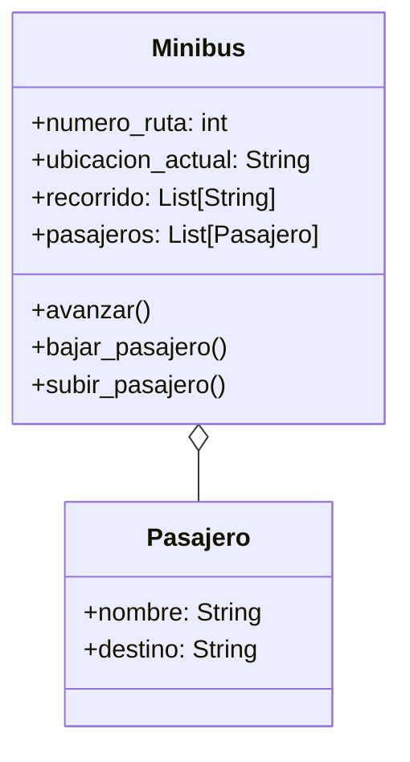

# Transporte

En su trayecto diario al trabajo, las personas pueden abordar distintos minibuses. Cada minibus está identificado por un número de ruta y sigue un recorrido compuesto por varias paradas (ubicaciones). Por otro lado, cada pasajero tiene un nombre y una ubicación de destino a la que desea llegar.
Los pasajeros pueden subir o bajar del minibus en cualquier parada, pero bajo las siguientes condiciones:

- Un pasajero solo puede subir si el recorrido del minibus incluye su destino entre las paradas programadas.
- Un pasajero solo puede bajar si la parada actual del minibus coincide con su destino.
- Las paradas son circulares: al llegar al final del recorrido, el minibus invierte su lista de paradas y regresa en sentido contrario.

Diseñar las clases necesarias para representar Minibus y Pasajero.
Toma en cuenta las siguientes características:

- Un minibus tiene una lista de paradas programadas (ejemplo: ["Arce", "Prado", "Perez"]).
- Un minibus puede transportar múltiples pasajeros.
Simular el movimiento del minibus entre paradas y las acciones de subida y bajada de pasajeros.

## Análisis

Requisitos:

- Los pasajeros pueden abordar distintos minibuses
- Cada minibus esta identificado por un numero de ruta y recorrido
- El recorrido de un minibus esta conformado por varias paradas (ubicaciones)
- Cada pasagero tiene: nombre y ubicacion de destino
- Los pasajeros pueden bajar y subir en cualquier parada bajo "condicones"
- Un pasajero solo puede subir si el recorrido del minibus incluye su destino
- Un pasajero solo puede bajar si la parada actual del minibus coincide con su destino
- Un minibus al llegar al final de su recorrido da vuelta y regresa en sentido contrario
- Un minibus tiene una lista de pardas ya preparadas
- Un minibus puede transportar múltiples pasajeros.

Objetos:

- Minibus
- Pasajero

Características:

- Minibus
  - numero_ruta: int
  - ubicacion_actual: String
  - recorrido: List[String]
  - pasajeros: List[Pasajero]
- Pasajero
  - nombre: String
  - destino: String

Acciones:

- Minibus
  - bajar_pasajero()
  - subir_pasajero()
  - avanzar()
- Pasajero

## Diagrama

