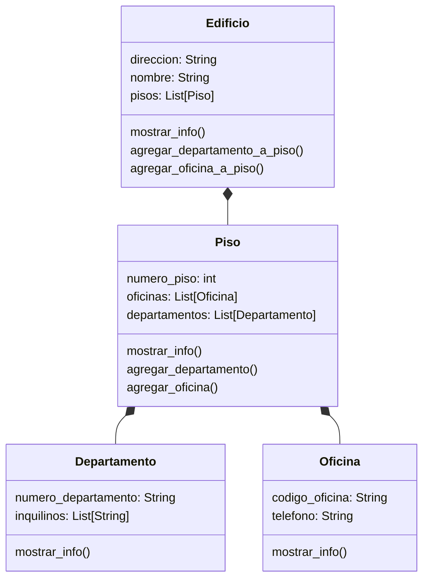

# Edificio

Se debe modelar un edificio ubicado en la ciudad de La Paz, compuesto por 3 pisos. Cada piso contiene una combinación de departamentos y oficinas

- Cada departamento tiene un número que comienza con el número del piso seguido de un número de unidad (por ejemplo: 201, 304).
- Cada oficina tiene un número que comienza con el número del piso seguido de una letra (por ejemplo: 2A, 3C).

Además:

- El edificio tiene `direccion` y `nombre`.
- Los pisos tienen un atributo `numero`
- Las oficinas cuentan con un atributo `telefono`.
- Los departamentos tienen un atributo `inquilinos`.

El sistema debe permitir:

- Crear un edificio con sus pisos correspondientes.
- Agregar departamentos y oficinas a cada piso.
- Acceder y mostrar la información del edificio de forma organizada y jerárquica

## Análisis

Requisitos:

- El edificio tiene un nombre y una direccion
- El piso tiene un numero de identificacion
- La oficina cuenta con un numero telefonico
- Los departamentos registran la lsita de inquilinos
- Un piso registra sus departamentos y oficinas
- El numero de departamento es coformado por el numero de piso y el numero de departamento (201)
- El numero de oficina es conformado por el numero de piso y letra de la oficina (3C)
- El edificio muestra su informacion de manera jerarquica
- El piso debe poder agregar oficinas y departamentos
- El edificio esta conformado de tres pisos

Objetos:

- Edificio
- Piso
- Oficina
- Departamento

Características:

- Edificio
  - direccion: String
  - nombre: String
  - pisos: List[Pisos]
- Piso
  - numero_piso: int
  - oficinas: List[Oficinas]
  - departamentos: List[Departamentos]
- Oficina
  - codigo_oficina: String
  - telefono: String
- Departamento
  - numero_departamento: String
  - inquilinos: List[String]

Acciones:

- Edificio
  - mostrar_info()
  - agregar_departamento_a_piso()
  - agregar_oficina_a_piso()
- Piso
  - mostrar_info()
  - agregar_departamento()
  - agregar_oficina()
- Oficina
  - mostrar_info()
- Departamento
  - mostrar_info()

## Diagrama

Clases:

- Edificio
  - Nombre: Edificio
  - Atributos:
    - direccion: String
    - nombre: String
    - pisos: List[Piso]
  - Metodos:
    - mostrar_info()
    - agregar_departamento_a_piso()
    - agregar_oficina_a_piso()
- Piso
  - Nombre: Piso
  - Atributos:
    - numero_piso: int
    - oficinas: List[Oficina]
    - departamentos: List[Departamento]
  - Metodos:
    - mostrar_info()
    - agregar_departamento()
    - agregar_oficina()
- Oficina
  - Nombre: Oficina
  - Atributos:
    - codigo_oficina: String
    - telefono: String
  - Metodos:
    - mostrar_info()
- Departamento
  - Nombre: Departamento
  - Atributos:
    - numero_departamento: String
    - inquilinos: List[String]
  - Metodos:
    - mostrar_info()

