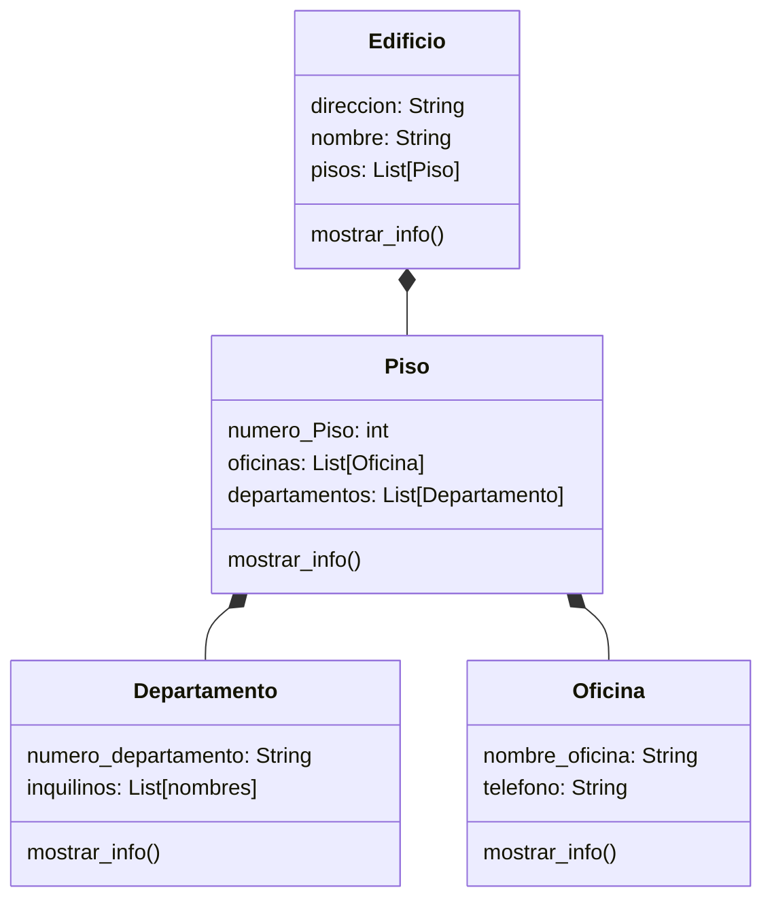

# Edificio

Se debe modelar un edificio ubicado en la ciudad de La Paz, compuesto por 3 pisos. Cada piso contiene una combinación de departamentos y oficinas

- Cada departamento tiene un número que comienza con el número del piso seguido de un número de unidad (por ejemplo: 201, 304).
- Cada oficina tiene un número que comienza con el número del piso seguido de una letra (por ejemplo: 2A, 3C).

Además:

- El edificio tiene `direccion` y `nombre`.
- Los pisos tienen un atributo `numero`
- Las oficinas cuentan con un atributo `telefono`.
- Los departamentos tienen un atributo `inquilinos`.

El sistema debe permitir:

- Crear un edificio con sus pisos correspondientes.
- Agregar departamentos y oficinas a cada piso.
- Acceder y mostrar la información del edificio de forma organizada y jerárquica

## Análisis

Requisitos:

- Crear un edificio en La Paz de 3 pisos
- Cada piso contiene una combinación de departamentos y oficinas
- Cada departamento tiene un número que comienza con el número del piso seguido de un número de unidad
- Cada oficina tiene un número que comienza con el número del piso seguido de una letra
- El edificio tiene los atributos de: direccion y nombre
- Los pisos tienen un atributo: numero
- Las oficinas cuentan con un atributo: telefono
- Los departamentos tienen un atributo: inquilinos
- Acceder y mostrar la información del edificio de forma organizada y jerárquica

Objetos:

- Edificio
- Pisos
- Oficinas
- Departamentos

Características:

- Edificio
  - direccion: String
  - nombre: String
  - pisos: List[Piso]
- Piso
  - numero_Piso: int
  - oficinas: List[Oficina]
  - departamentos: List[Departamento]
- Oficina
  - nombre_oficina: String
  - telefono: String
- Departamento
  - numero_departamento: String
  - inquilinos: List[nombres]

Acciones:

- Edificio
  - mostrar_info()
- Pisos
  - mostrar_info()
- Oficinas
  - mostrar_info()
- Departamentos
  - mostrar_info()

## Diagrama

