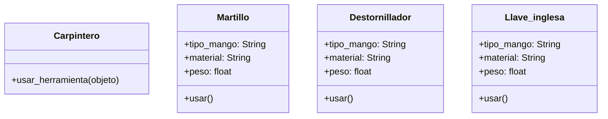

# Taller

En un taller de carpintería, los trabajadores utilizan diferentes herramientas para construir muebles, reparar objetos o ajustar piezas.
Cada herramienta tiene una función específica, pero todas pueden ser utilizadas por el carpintero de manera similar.
Por ejemplo:

- El martillo se usa para clavar clavos
- El destornillador se usa para ajustar tornillos
- La llave inglesa se usa para apretar tuercas

El carpintero no necesita saber el tipo exacto de herramienta que está utilizando, solo necesita que la herramienta pueda ejecutar la acción usar()

## Analisis

Requisitos:

- los trabajadores utilizan diferentes herramientas para construir muebles, reparar objetos o ajustar piezas.
- Cada herramienta tiene una función específica
- Todas las herramientas pueden ser utilizadas por el carpintero.
- El martillo se usa para clavar clavos
- El destornillador se usa para ajustar tornillos
- La llave inglesa se usa para apretar tuercas
- Todas las herramientas tiene una acción usar()

Objetos:

- Carpintero
- Martillo
- Destornillador
- Llave_inglesa

Características:

- Carpintero
  - (sin características)
- Martillo
  - tipo_mango: String
  - material: String
  - peso: float
- Destornillador
  - tipo_mango: String
  - material: String
  - peso: float
- Llave_inglesa
  - tipo_mango: String
  - material: String
  - peso: float

Acciones:

- Carpintero
  - usar_herramienta()
- Martillo
  - usar()
- Destornillador
  - usar()
- Llave_inglesa
  - usar()

## Diagrama

