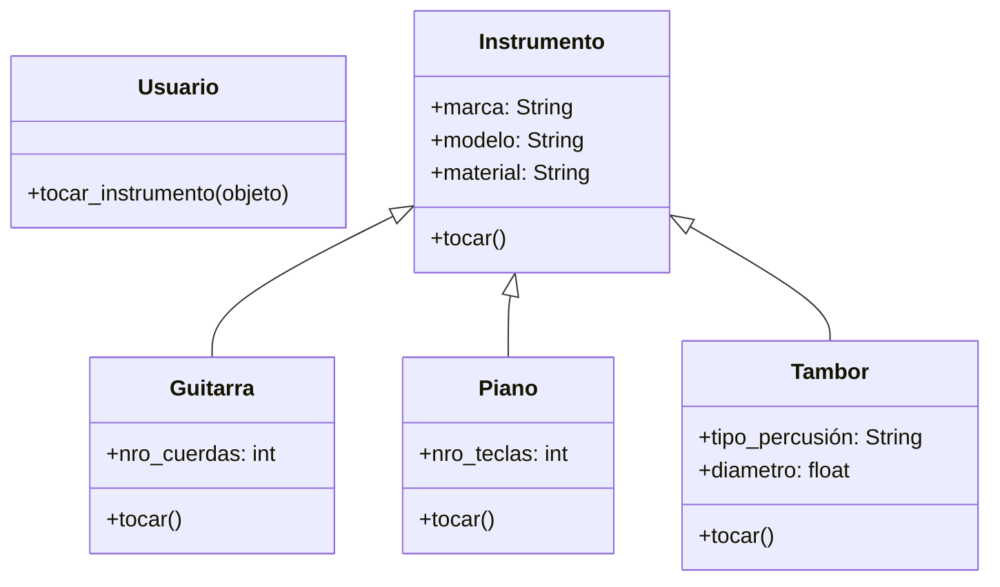

# Aplicacion musical

Una aplicación de aprendizaje musical permite a los usuarios practicar con distintos instrumentos Cada instrumento tiene una forma particular de producir sonido, pero todos pueden ser tocados por el usuario mediante una acción común.
Por ejemplo:

- La guitarra hace "strum"
- El piano hace "plin"
- El tambor hace "boom"

Aunque cada instrumento suena distinto, todos comparten una característica común:
pueden ejecutar la acción `tocar()`

## Analisis

Requisitos:

- Todos los instrumentos son tocados por el usuario, por una accion comun
- La guitarra hace "strum"
- El piano hace "plin"
- El tambor hace "boom"

Objetos:

- Usuario
- Instrumento
- Guitarra
- Piano
- Tambor

Características:

- Usuario
  - (sin características)
- Instrumento
  - marca: String
  - modelo: String
  - material: String
- Guitarra
  - nro_cuerdas: int
- Piano
  - nro_teclas: int
- Tambor
  - tipo_percusión: String
  - diametro: float

Acciones:

- Usuario
  - tocar_instrumento()
- Instrumento
  - tocar()
- Guitarra
  - tocar()
- Piano
  - tocar()
- Tambor
  - tocar()

## Diagrama

