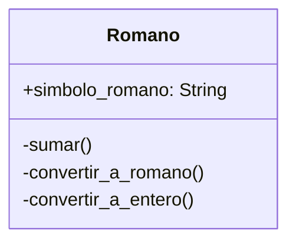

# Calculadora

Un profesor de matemáticas utiliza una calculadora de números romanos para enseñar aritmética clásica. Cada número se representa mediante una letra o combinación de letras romanas, como:

- I = 1
- V = 5
- X = 10
- L = 50
- C = 100

## Analisis

Requisitos:

- Calculadora de numeros romanos
- Los numeros se representan por una letra o combinación de letras
- Los números romanos pueden sumarse entre sí
- El resultado de la suma es un nuevo objeto Romano

Objetos:

- Romano

Características:

- Romano
  - simbolo_romano: String

Acciones:

- Romano
  - sumar()
  - convertir_a_entero()
  - convertir_a_romano()

## Diagrama

