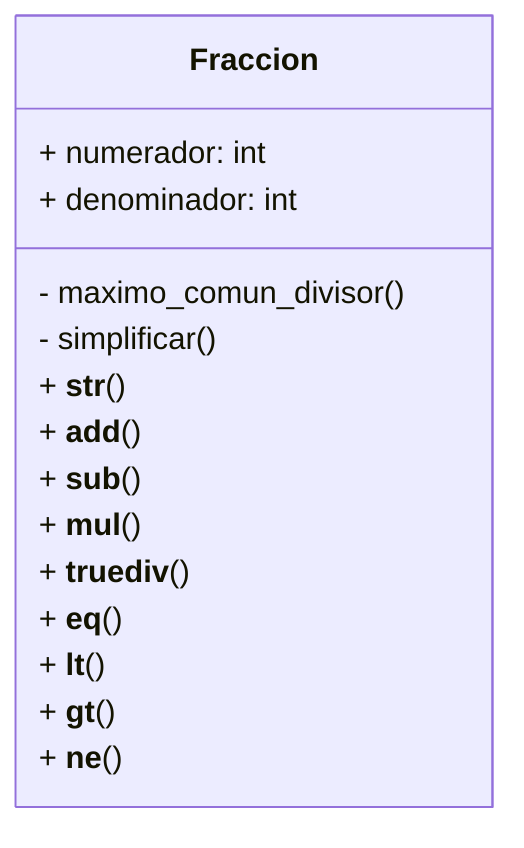

Un profesor de matemáticas necesita una calculadora de fracciones para enseñar
conceptos básicos de aritmética. Cada fracción se representa mediante un
numerador y un denominador.

- Por ejemplo, la fracción 3/4 tiene un numerador igual a 3 y un denominador
igual a 4.

Crea la clase Fraccion que permita representar y operar con fracciones de forma intuitiva utilizando métodos especiales (dunder methods) y cumpla con los
siguientes:

- Representación: `"numerador/denominador"`
- Puede sumar con otra fracción, operador: `+`
- Puede restar con otra fracción, operador: `-`
- Puede multiplicar con otra fracción, operador: `*`
- Puede dividir con otra fracción, operador: `/`

Además, la clase Fraccion debe permitir comparar:

- Con otra fracción para igualdad, operador: `==`
- Con otra fracción para menor que, operador: `<`
- Con otra fracción para mayor que, operador: `>`
- Con otra fracción para desigualdad, operador: `!=`

# Analisis

Requerimientos:

- Una calculadora realiza operaciones utilizando las fracciones
- Una fraccion esta determinada por un `numerador` y `denominador`
- Los valores del numerador y denominador deben ser enteros
- Las fracciones pueden realizar las operaciones aritemeticas
como: `+`, `-`, `*`, `/`
- El resultado de las operaciones debe representarse en su `minima exprecion`,
en forma de fraccion si es posible (1/1 = 1, 0/2 = 0)
- Una fraccion de denominador `0` debera dar error, ya que es indeterminada
- Se utilizara el maximo comun divisor para la simplificacion
- Las fracciones pueden realizar operaciones de comparacion, `==`, `<`, `>`, `!=`

Objetos:

- Fraccion

Caracteristicas:

- Fraccion
  - numerador: int
  - denominador: int

Acciones:

- Fraccion
  - representacion_en_cadena()
  - maximo_comun_divisor()
  - simplificar()
  - suma()
  - resta()
  - multiplicacion()
  - dividicion()
  - igualdad()
  - menor_que()
  - mayor_que()
  - diferentes()

# Diseño

