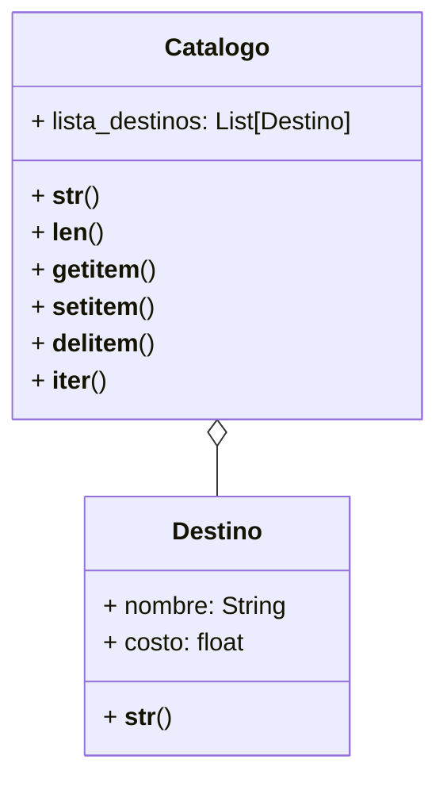

Una agencia de viajes gestiona un catálogo digital que contiene información
sobre destinos turísticos. Cada destino tiene un nombre y un costo asociado, y
la agencia desea que el catálogo permita visualizar, modificar y recorrer los
destinos de forma intuitiva.

- Los destinos se representan como:
`"[destino] ➡ [costo] USD"`
- El Catálogo de Destinos se representa como:

🗺 Destinos 🗺

1. destino1
2. destino2
...
n. destinoN

El catálogo debe permitir:

- Ver la longitud del catálogo,len(catalogo)
- Acceder por su índice,catalogo[indice]
- Agregar destinos,catalogo[indice]=destino
- Eliminar destinos,del catalogo[indice]
- Iterar sobre los destinos,for destino in catalogo
- Ver el catálogo en el formato especificado
- Ver un destino en el formato especificado

# Analisis

Requisitos:

- El catalogo contiene un registro de destinos turisticos
- EL catalogo se representa como:
`🗺 Destinos 🗺`
`1. destino_uno`
`2. destino_dos`
- El catalogo permite la modificacion de los destinos turisticos
- El catalogo permite recorrer los destinos turisticos
- El catalogo debe saber cuantos destino turisticos hay
- EL catalogo permite acceder por indice de destino turistico
- El catalogo permite iterar sobre cada destino turistico
los mismos
- El catalogo permite agregar destinos turisticos
- El catalogo permite eliminar destinos turisticos
- Los destinos turisticos tiene un nombre y costo asociado
- Los destinos se representa como: `"[destino] ➡ [costo] USD"`
- Existe una relacion de agregacion entre catalogo y destino turistico

Objetos:

- Catalogo
- Destino

Caracteristicas:

- Catalogo
  - lista_destinos: List[Destino]
- Destino
  - nombre: String
  - costo: float

Acciones:

- Catalogo
  - longitud()
  - representacion()
  - acceso_destinos_por_indice()
  - agregar()
  - eliminar()
  - iterar()
- Destino
  - representacion()

# Diseño

