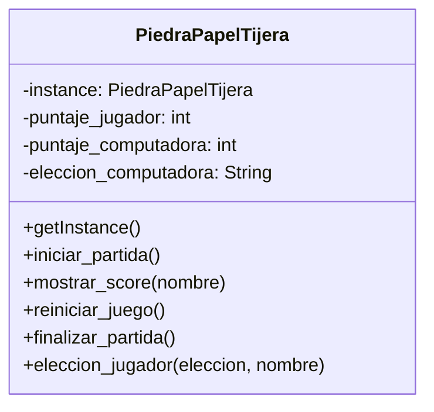

# Analisis

Requerimientos:

- La computadora seleccionara aleatoriamente entre: piedra, papel y tijera
- El jugador debe seleccionar entre: piedra, papel y tijera
- El juego debe informar el ganador del enfrentamiento de la partida actual
- El juego tendra la opcion de iniciar una nueva partida
- Se podra seleccionar la opcion salir del juego
- El juego guarda un registro del Score del jugador y la computadora
- El juego podra mostrar los puntajes acumulados del jugador y la computadora
- El juego tendra la opcion de reiniciar el Score del jugador y la computadora

Objetos:

- PiedraPapelTijera

Caracteristicas:

- PiedraPapelTijera
  - eleccion_computadora: String
  - puntaje_jugador: int
  - puntaje_computadora: int

Acciones:

- PiedraPapelTijera
  - iniciar_partida()
  - mostrar_score()
  - reiniciar_juego()
  - finalizar_partida()
  - eleccion_jugador()

# Diseño

Clases:

- PiedraPapelTijera
  - Nombre: PiedraPapelTijera
  - Atributos:
    - instance: PiedraPapelTijera
    - puntaje_jugador: int
    - puntaje_computadora: int
    - eleccion_computadora: String
  - Métodos:
    - getInstance()
    - iniciar_partida()
    - mostrar_score(nombre)
    - reiniciar_juego()
    - finalizar_partida()
    - eleccion_jugador(eleccion, nombre)

