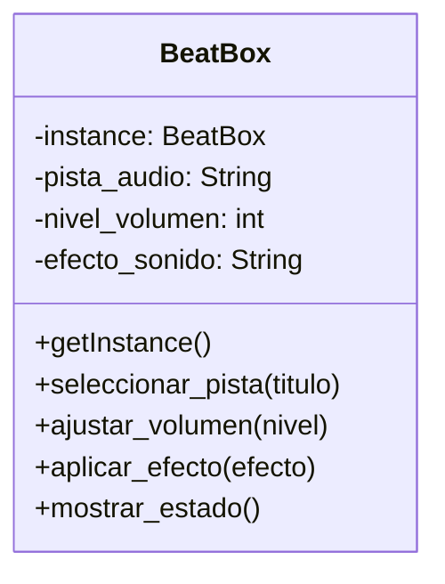

# Analisis

Requerimientos:

- Consola mescladora de pistas de audio
- La consola permite seleccionar pistas de audio
- Para cambiar de pista de audio se introducira el titulo de la nueva pista
- La consolo permite subir o bajar el volumen de la misma
- Se puede consultar el estado actual de la consola (pista de audio y
nivel de volumen)
- La consola tiene efectos de audio que se aplican uno a la ves
- Los efectos de sonido unicos son: eco, reverb y distorsion

Objetos:

- BeatBox

Caracteristicas:

- BeatBox
  - pista_audio: String
  - nivel_volumen: int
  - efecto_sonido: String

Acciones:

- BeatBox
  - seleccionar_pista()
  - ajustar_volumen()
  - aplicar_efecto()
  - mostrar_estado()

# Diseño

Clases:

- BeatBox
  - Nombre: BeatBox
  - Atributos:
    - instance: BeatBox
    - pista_audio: String
    - nivel_volumen: int
    - efecto_sonido: String
  - Métodos:
    - getInstance()
    - seleccionar_pista(titulo)
    - ajustar_volumen(nivel)
    - aplicar_efecto(efecto)
    - mostrar_estado()

