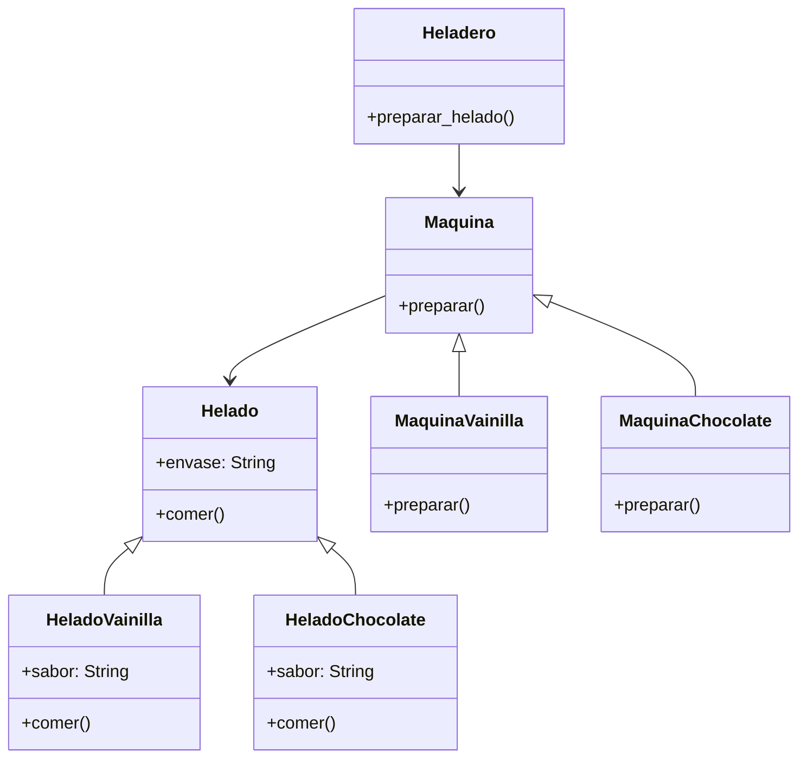

# Heladeria

## Analisis

Requisitos:

- El helados se puede preparar de sabor vainilla o chocolate
- El cliente debe pedir el tipo de helado que desea
- El helado debe registrar el tipo de envase: cono o vaso
- El Encargado debe utilizar la Máquina adecuada para el sabor solicitado.
- La maquinas preparan el helado correspondiente a su sabor
- Todos los helados se pueden comer

Objetos:

- Helado
- HeladoVainilla
- HeladoChocolate
- Maquina
- MaquinaVainilla
- MaquinaChocolate
- Heladero

Características:

- Helado
  - envase: String
- HeladoVainilla
  - sabor: String
- HeladoChocolate
  - sabor: String
- Maquina
  - (sin características)
- MaquinaVainilla
  - (sin características)
- MaquinaChocolate
  - (sin características)
- Heladero
  - (sin características)

Acciones:

- Helado
  - comer()
- HeladoVainilla
  - comer()
- HeladoChocolate
  - comer()
- Maquina
  - preparar()
- MaquinaVainilla
  - preparar()
- MaquinaChocolate
  - preparar()
- Heladero
  - preparar_helado()

## Diagrama

Clases:

- Helado
  - Nombre: Helado
  - Atributos:
    - envase: String
  - Metodos:
    - comer()
- HeladoVainilla
  - Nombre: HeladoVainilla
  - Atributos:
    - sabor: String
  - Metodos:
    - comer()
- HeladoChocolate
  - Nombre: HeladoChocolate
  - Atributos:
    - sabor: String
  - Metodos:
    - comer()
- Maquina
  - Nombre: Maquina
  - Atributos:
    - (sin atributos)
  - Metodos:
    - preparar()
- MaquinaVainilla
  - Nombre: MaquinaVainilla
  - Atributos:
    - (sin atributos)
  - Metodos:
    - preparar()
- MaquinaChocolate
  - Nombre: MaquinaChocolate
  - Atributos:
    - (sin atributos)
  - Metodos:
    - preparar()
- Heladero
  - Nombre: Heladero
  - Atributos:
    - (sin atributos)
  - Metodos:
    - preparar_helado()

