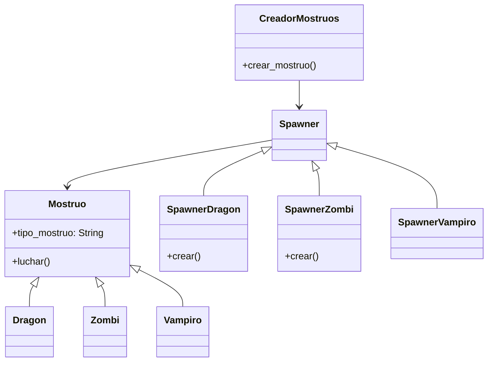

# Batalla de Monstruos

## Analisis

Requisitos:

- Hay tres tipos de mostruos: dragon, zombi y vampiro
- El jugador debe registrar el tipo de mostruo que desea
- Los mostruos luchan entre ellos
- El dragon es fuerte frente al zombi, devil frente al vampiro
- El zombi es fuerte frente al vampiro, devil frente el dragon
- El vampiro es fuerte frente el dragon, devil frente al zombi
- Los mostruos que enfrentan al mismo tipo dan un empate

Objetos:

- Mostruo (clase padre)
- dragon (hereda de Mostruo)
- zombi (hereda de Mostruo)
- vampiro (hereda de Mostruo)
- Spawner (clase padre)
- SpawnerDragon (hereda Spawner)
- SpawnerZombi (hereda Spawner)
- SpawnerVampiro (hereda Spawner)
- CreadorMostruos

Características:

- Mostruo
  - tipo_mostruo: String
- Dragon
  - (sin caracteristicas)
- Zombi
  - (sin caracteristicas)
- Vampiro
  - (sin caracteristicas)
- Spawner
  - (sin caracteristicas)
- SpawnerDragon
  - (sin caracteristicas)
- SpawnerZombi
  - (sin caracteristicas)
- SpawnerVampiro
  - (sin caracteristicas)
- CreadorMostruos
  - (sin caracteristicas)

Acciones:

- Mostruo
  - luchar()
- Dragon
  - (sin acciones)
- Zombi
  - (sin acciones)
- Vampiro
  - (sin acciones)
- Spawner
  - crear()
- SpawnerDragon
  - crear()
- SpawnerZombi
  - crear()
- SpawnerVampiro
  - crear()
- CreadorMostruos
  - crear_mostruo()

## Diagrama

Clases:

- Mostruo
  - Nombre: Mostruo
  - Atributos:
    - tipo_mostruo: String
  - Metodos:
    - luchar()
- Dragon
  - Nombre: Dragon
  - Atributos:
    - (sin atributos)
  - Metodos:
    - (sin metodos)
- Zombi
  - Nombre: Zombi
  - Atributos:
    - (sin atributos)
  - Metodos:
    - (sin metodos)
- Vampiro
  - Nombre: Vampiro
  - Atributos:
    - (sin atributos)
  - Metodos:
    - (sin metodos)
- Spawner
  - Nombre: Spawner
  - Atributos:
    - (sin atributos)
  - Metodos:
    - crear()
- SpawnerDragon
  - Nombre: SpawnerDragon
  - Atributos:
    - (sin atributos)
  - Metodos:
    - crear()
- SpawnerZombi
  - Nombre: SpawnerZombi
  - Atributos:
    - (sin atributos)
  - Metodos:
    - crear()
- SpawnerVampiro
  - Nombre: SpawnerVampiro
  - Atributos:
    - (sin atributos)
  - Metodos:
    - crear()
- CreadorMostruos
  - Nombre: CreadorMostruos
  - Atributos:
    - (sin atributos)
  - Metodos:
    - crear_mostruo()

