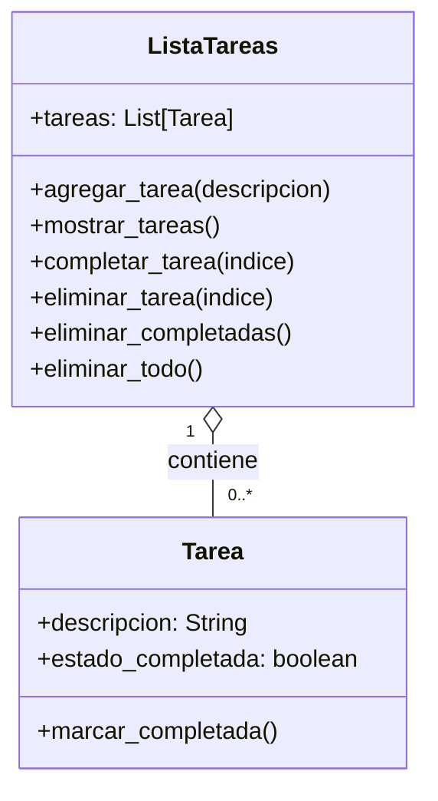

# Sistema Gestion de tareas

## Análisis

Requisitos:

- Las tareas se registran con una descripcion
- Una tarea puede estar completada o no
- El usuario puede visualizar la lista completa de tareas y su estado
- Se puede marcar una tarea específica como completada
- Las taresa pueden ser eliminadas de la lista
- Se puede eliminar todas las tareas completadas de la lista
- Se puede vaciar la totalidad de tareas en la lista

Objetos:

- Tarea
- ListaTareas

Características:

- Tarea
  - descripcion: String
  - estado_completada: boolean
- ListaTareas
  - tareas: List[Tarea]

Acciones:

- Tarea
  - marcar_completada()
- ListaTareas
  - agregar_tarea()
  - mostrar_tareas()
  - completar_tarea()
  - eliminar_tarea()
  - eliminar_completadas()
  - eliminar_todo()

## Diagrama

Clases:

- Tarea
  - Nombre: Tarea
  - Atributos:
    - descripcion: String
    - estado_completada: boolea
  - Métodos:
    - marcar_completada()
- ListaTareas
  - Nombre: ListaTareas
  - Atributos:
    - tareas: List[Tarea]
  - Métodos:
    - agregar_tarea(descripcion: String)
    - mostrar_tareas()
    - completar_tarea(indice: int)
    - eliminar_tarea(indice: int)
    - eliminar_completadas()
    - eliminar_todo()

