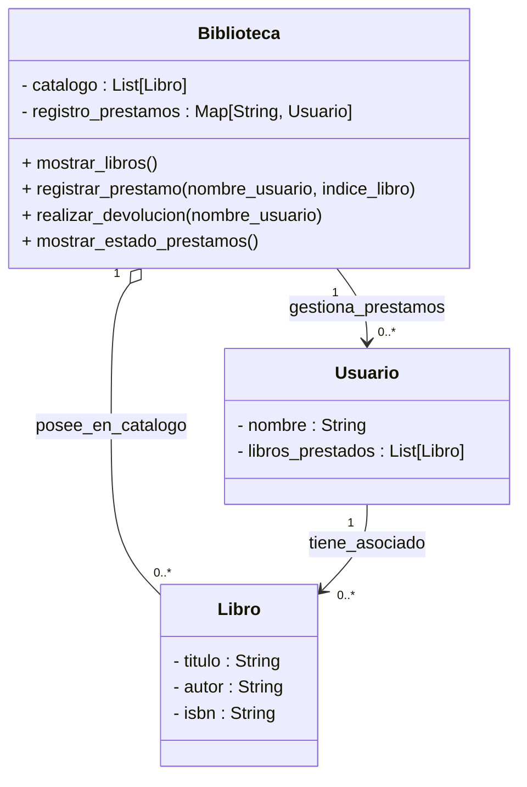

# Biblioteca Municipal

## Análisis

Requisitos:

- Un libro registra su Título, Autor y ISBN
- Un usuario registra su nombre y los libros que tiene prestados
- Los usuario pueden elegir uno o varios libros de la biblioteca
- Los prestamos se registran al usuario
- La devolución se realiza entregando todos los libros prestados al mismo tiempo
- Se puede visualizar que usuarios tienen libros prestados

Objetos:

- Libro
- Usuario
- Biblioteca

Características:

- Libro
  - titulo: String
  - autor: String
  - isbn: String
- Usuario
  - nombre: String
  - libros_prestados: Lista[Libro]
- Biblioteca
  - catalogo: Lista[Libro]
  - prestamos: {String:Usuario}

Acciones:

- Libro
  - (sin acciones)
- Usuario
  - (sin acciones)
- Biblioteca
  - mostrar_libros()
  - registrar_prestamo(nombre, indice_libro)
  - realizar_devolucion(nombre)
  - mostrar_prestamos()

## Diagrama de Clases

Clases:

- Libro
  - Nombre: Libro
  - Atributos:
    - titulo: String
    - autor: String
    - isbn: String
  - Métodos:
    - (sin metodos)
- Usuario
  - Nombre: Usuario
  - Atributos:
    - nombre: String
    - libros_prestados: Lista[Libro]
  - Métodos:
    - (sin metodos)
- Biblioteca
  - Nombre: Biblioteca
  - Atributos:
    - catalogo: Lista[Libro]
    - prestamos: {String:Usuario}
  - Métodos:
    - mostrar_libros()
    - registrar_prestamo(nombre, indice_libro)
    - realizar_devolucion(nombre)
    - mostrar_prestamos()

