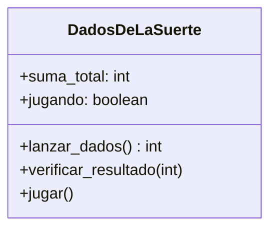

# Dados de la Suerte

## Analisis

Requisitos:

- El juego permite lanzar dos dados automáticamente
- Si la suma de los dados es 7 u 11, el jugador gana
- Si la suma de los dados es 2, 3 o 12, el jugador pierde
- Con cualquier otro valor, el jugador puede elegir volver a lanzar
- El usuario decide mediante "SI" o "NO" si desea continuar lanzando
- El juego termina al ganar, perder o cuando el usuario decide no lanzar más
- Mostrar el mensaje final con el resultado de la partida

Objetos:

- DadosDeLaSuerte

Características:

- DadosDeLaSuerte
  - suma_total: int
  - jugando: boolean

Acciones:

- DadosDeLaSuerte
  - lanzar_dados()
  - verificar_resultado()
  - jugar()

## Diagrama

Clases:

- DadosDeLaSuerte
  - Nombre: DadosDeLaSuerte
  - Atributos:
    - suma_total: int
    - jugando: boolean
  - Métodos:
    - lanzar_dados(): int
    - verificar_resultado(int)
    - jugar()

