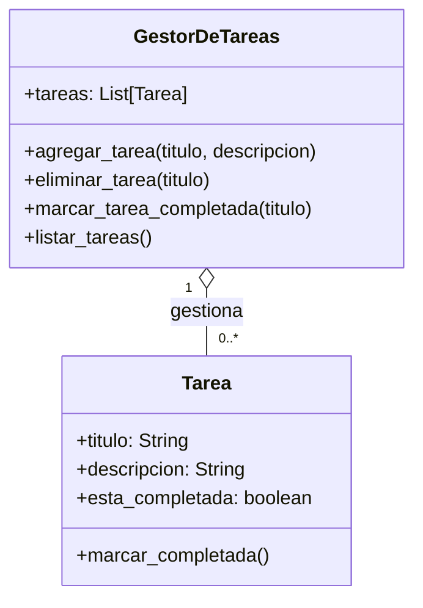

# Gestion de tareas

## Analisis

Requisitos:

- Se registran las tareas con un título y una descripción
- Cada tarea inicia con un estado de "no completada"
- Se permite eliminar una tarea específica buscando por su título
- El usuario puede marcar una tarea como completada indicando su título
- Se puede visualizar la lista completa de tareas y su estado actual
- Se cuenta con un menú interactivo para realizar estas acciones

Objetos:

- Tarea
- GestorDeTareas

Características:

- Tarea
  - titulo: String
  - descripcion: String
  - esta_completada: boolean
- GestorDeTareas
  - tareas: List[Tarea]

Acciones:

- Tarea
  - marcar_completada()
- GestorDeTareas
  - agregar_tarea(titulo, descripcion)
  - eliminar_tarea(titulo)
  - marcar_tarea_completada(titulo)
  - listar_tareas()

## Diagrama

Clases:

- Tarea
  - Nombre: Tarea
  - Atributos:
    - titulo: String
    - descripcion: String
    - esta_completada: boolean
  - Métodos:
    - marcar_completada()

- GestorDeTareas
  - Nombre: GestorDeTareas
  - Atributos:
    - tareas: List[Tarea]
  - Métodos:
    - agregar_tarea(titulo, descripcion)
    - eliminar_tarea(titulo)
    - marcar_tarea_completada(titulo)
    - listar_tareas()

