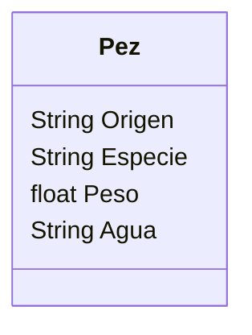

# Acuario

Un acuario quiere llevar un registro de los peces que tiene.
Necesitan registrar la especie, peso y origen.
Los peces pueden ser de agua dulce o salada.
Todos los peces son criados en cautiverio.
Antes de liberarlos se actualiza su peso y luego son liberados.

## Analisis

Requisitos:

- Registrar peces
- Registrar los atributos de cada pez
- Todos los peces son criados en cautiverio
- Liberar pez
- Actualiza peso del pez antes de liberar

Objetos:

- Pez

Características:

- Pez
  - Especie
  - Peso
  - Origen
  - Agua

Acciones:

- (No hay acciones)

## Diseño

