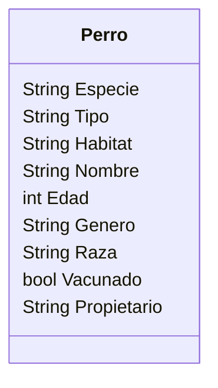

# Clinica

En un clinica veterinaria quieres registrar a los perros que llegan a consulta.
De cada perro se necesita registrar su nombre, edad, género, raza y si está vacunado ademas del nombre del propietario.

## Analisis

Requisitos:

- Registrar perros
- Registrar atributos de cada perro
- Todos los perros son caninos, mamíferos y terrestres

Objetos:

- Perro

Caracteristicas:

- Perro
  - Especie
  - Tipo
  - Habitat
  - Nombre
  - Edad
  - Genero
  - Raza
  - Vacunado
  - Propetario

Acciones:

- (No hay acciones)

## Diseño

