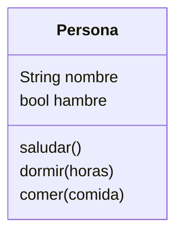
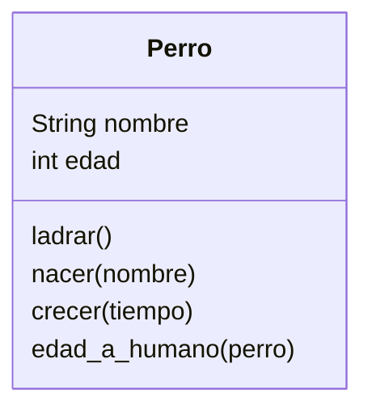

# Juego PyLife

Crearemos un juego similar a Sims llamado `PyLife`
Las personas creadas tienen un nombre y
pueden saludar diciendo su nombre

## Analisis

Requisitos:

- Crear personas
- Las personas tienen un nombre
- Las personas pueden saludar
- Las personas pueden dormir
- Las personas pueden comer
- Al despertar tienen hambre

Objetos:

- Persona

Características:

- Persona: Nombre, hambre
  
Acciones:

- Persona: Saludar, dormir, comer

## Diseño

En el juego `PyLife` diseñaremos ahora perros que pueden ladrar
Todos los perros tienen un nombre y empiezan como cachorros
La diferencia entre un perro y un humano en edad es de 7 años
y los perros pueden crecer con el tiempo

## Analisis2

Requisitos:

- Crear un perro
- Los perros tienen un nombre
- Los perros pueden ladrar
- Los perros nacen como cachorros
- La edad de un perro es 7 veces menor que la de un humano

Objetos:

- Perro

Características:

- Perro: nombre, edad

Acciones:

- Perro: ladrar, nacer, crecer, edad_a_humano

## Diseño2

