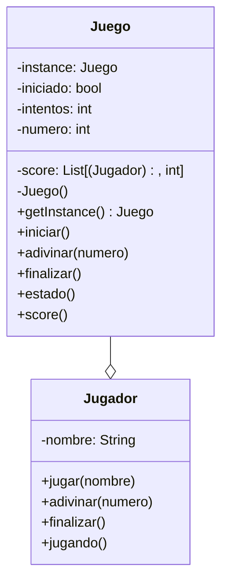

El juego "Adivina el número" permite a un jugador adivinar
un número secreto entre 1 y 100. El juego sólo permite un
número a la vez y da pistas si el número es mayor o menor
que el número secreto.
Cada vez que un jugador adivina se guarda el jugador,
el número de intentos que le tomó adivinar y se muestra el score
El juego termina cuando el jugador escribe "salir"
Cada jugador posee un nombre

# Analisis

Requisitos:

- El juego debe seleccionar un numero secreto al azar entre 1 y 100
- El jugador debe adivinar el nuemro secreto
- EL juego debe informar si el numero dado por el jugador es mayor o menor
que el numero secreto
- El juego guarda un registro del Score con el jugador y el numero de intentos
- El juego termina cuando el jugador escribe salir

Objetos:

- Juego: Representa el juego en si
- Jugador: Representa al jugador que tiene que adivinar el numero secreto

Caracteristicas:

- Juego
  - numero_secreto: int
  - score: int
- Jugador
  - nombre: String

Acciones:

- Juego
  - iniciar()
  - adivinar()
  - score()
  - estado()
  - finalizar()
- Jugador
  - jugar()
  - adivinar()
  - finalizar()
  - jugando()

# Diagrama

