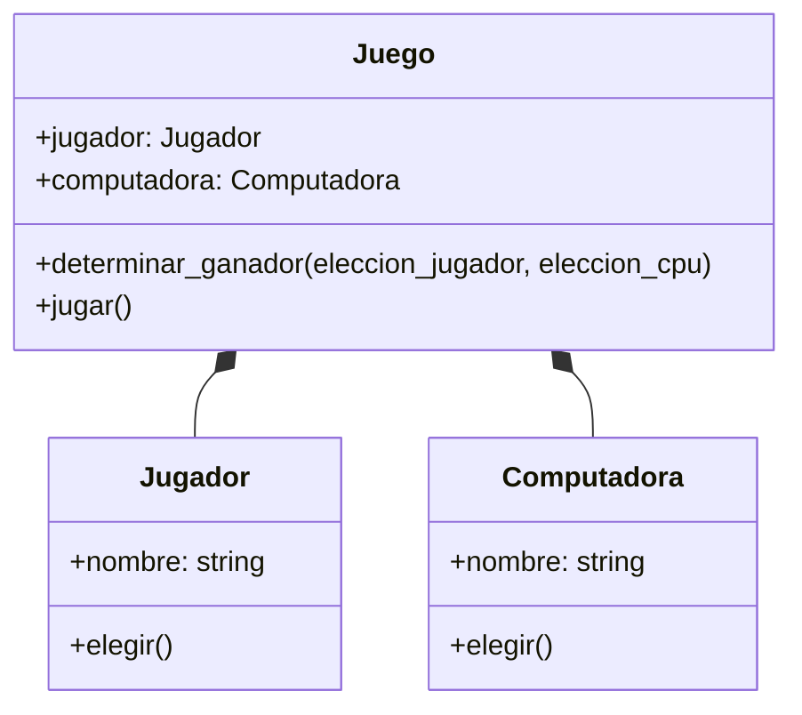

# Análisis

Requisitos:

- El jugador debe ingresar su nombre
- El jugador debe elegir entre piedra, papel o tijera
- La computadora debe elegir al azar entre piedra, papel o tijera
- El juego debe determinar el ganador según las reglas del juego
- El juego debe mostrar el resultado de cada partida
- El juego debe permitir al jugador jugar varias partidas
- El juego debe tener un menú para jugar o salir
- El juego esta compuesto por ambos jugadores (Jugador y Computadora)

Objetos:

- Jugador
- Computadora
- Juego

Características:

- Jugador:
  - nombre
- Computadora:
  - nombre
- Juego:
  - jugador
  - computadora

Acciones:

- Jugador:
  - elegir
  - validar eleccion
  - ingresar
- Computadora:
  - elegir
- Juego:
  - jugar
  - determinar ganador
  - mostrar elecciones

# Diseño

